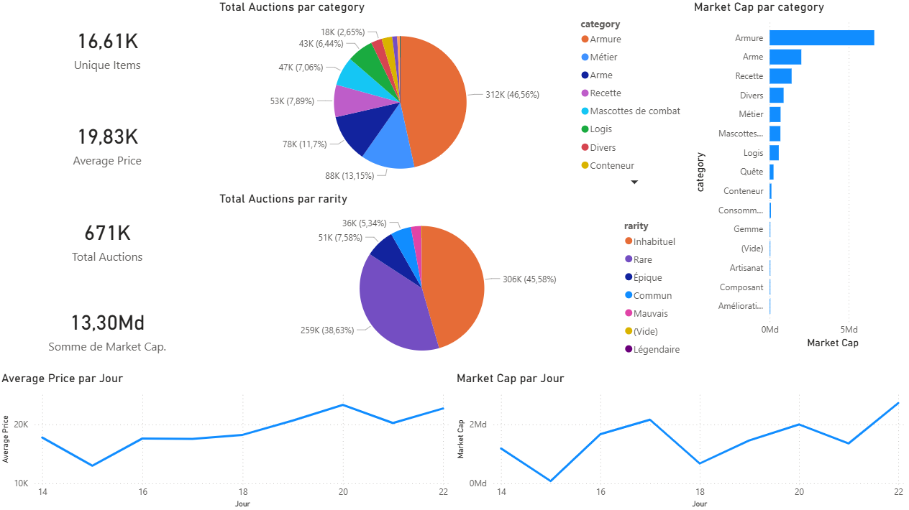

# WoW Economy Data Warehouse (ETL Pipeline)

A comprehensive Data Engineering project designed to Extract, Transform, and Load (ETL) real-time economic data from the World of Warcraft Auction House (Hyjal Server) into a local SQL Server Data Warehouse to analyze WoW's economy system.

### Final output: The WoW Economy Dashboard

Here is a snapshot of the Power BI dashboard fed by this ETL pipeline. It visualizes key metrics such as total auctions, market capitalization by category, price trends over time, and rarity distribution.

## Why World of Warcraft?
MMORPGs serve as massive sandbox environments that closely mirror real-world human behavior. Just as the infamous "Corrupted Blood" virtual epidemic in WoW was utilized by epidemiologists to model real-world disease spread in recognized scientific papers, the game's Auction House provides a highly consistent, data-rich ecosystem. It is an ideal testing ground to study real-world economic principles such as inflation, market manipulation, and supply/demand elasticity using millions of active, player-driven data points.

## Project Objective
Automate the extraction of massive transaction datasets to build a resilient data architecture, allowing for advanced analytics on a dynamic virtual economy.

## Technical Architecture
* **Extract:** Python scripts querying the official Blizzard REST API (bypassing strict WAF restrictions via custom HTTP headers).
* **Transform:** SQL-based transformations in the Silver layer (Window functions for deduplication, type casting, text normalization).
* **Load:** Massive data ingestion (`BULK INSERT`) into a local SQL Server database, processed via Stored Procedures.

### Data Modeling & Processing
- Implementation of a Medallion Architecture (Bronze, Silver, Gold)
- SQL-based data transformation (ELT approach)
- Data cleaning and deduplication in the Silver layer

## Data Processing Strategy

This project follows an ELT approach:
- Raw data is ingested without modification
- Transformations are performed directly in SQL
- This ensures scalability and reproducibility of data pipelines

The database is structured using dedicated schemas:

- `bronze` → raw ingested data (no transformation)
- `silver` → cleaned, deduplicated, and normalized data
- `gold` → business-ready analytical models (Star Schema)

## Repository Structure

### Python Scripts

- `extract_erp_auctions.py`
  → Extracts live auction data from Blizzard API and saves it as CSV

- `extract_crm_items.py`
  → Builds and auto-syncs a reference dataset mapping item IDs to names. Automatically isolates missing items from the ERP and performs targeted API delta loads.

- `auto_collector.py`
  → Runs continuously to collect auction snapshots over time (historical tracking)

- `lua_parser.py`
  → Parses Lua addon files and converts them into clean CSV datasets

---

### SQL Scripts

- `init_database.sql`
  → Creates the `wow_economy` database and initializes schemas (`bronze`, `silver`, `gold`)

- `01_ddl_bronze_layer.sql`
  → Defines raw tables in the `bronze` schema

- `02_load_bronze_layer.sql`
  → Loads CSV data into bronze tables using `BULK INSERT`

- `03_ddl_silver_layer.sql`
  → Creates the cleaned tables in the `silver` schema with proper data types.

- `04_proc&load_silver.sql`
  → Stored procedure executing the ETL process: truncates tables, removes duplicates, and converts currencies.

- `05_gold_dim.sql`
  → Creates the dimension view (`dim_items`) for the Gold layer Star Schema.

- `06_gold_facts.sql`
  → Creates the fact view (`fact_auctions`) for the Gold layer Star Schema.

### Data Quality Assessment (DQA)
A suite of SQL validation scripts to ensure data integrity during pipeline execution:
- `check_duplicates_crm.sql` / `check_duplicates_erp.sql` → Validates window function deduplication.
- `check_no_APIbug.sql` → Identifies negative values or aberrant quantities.
- `check_no_id.sql` → Ensures referential integrity between auctions and the item dictionary (Orphan records).
- `check_null_values.sql` → Tracks missing critical data points.

### Business Analytics Queries
A collection of pre-built SQL queries answering direct business questions on the Gold layer:
- `Most_Expensive_Objects.sql` → Top 10 luxury items by average gold price.
- `Proportion_by_Rarity.sql` → Volume distribution of items by rarity.
- `Biggest_Variations.sql` → Identifies high speculation items by calculating max/min price gaps (filtering out RMT outliers).
- `Market_Cap_by_Category.sql` → Calculates the total gold value (Market Cap) generated by each item category.
- `Most_listed_items.sql` → Identifies saturated markets by tracking the highest volume of active auctions.
- `Daily_Market_Trend.sql` → Macro-economic trend tracking daily listing volumes and server-wide average prices.

## How to Run
1. Clone the repository.
2. Add your Blizzard API credentials to a `.env` file.
3. Start the hourly data collection daemon: `python auto_collector.py`. This will create the `history_erp_auctions.csv` file, which will contain every auction available every hour.
4. Generate the static reference table: `python extract_crm_items.py`. This will create `source_crm_items.csv`, the dictionary mapping the item IDs to the items themselves.
5. Execute the `.sql` scripts in numerical order. These will build the data infrastructure as described above.
6. Connect Power BI (or any other BI tool) to your Gold views to report on the data analysis.

*(Note: For security and storage optimization, raw data files (.csv, .json), and client tokens are excluded from this repository via `.gitignore`).*

## Current Progress: Medallion Architecture
* **[x] Bronze Layer:** Implemented automated massive data ingestion of flat CSV files into a local SQL Server database. The raw layer schema strictly mirrors the source API extracts to ensure zero data loss and historical tracking.
* **[x] Silver Layer:** Developed SQL Stored Procedures for ETL processing. Implemented deduplication via Window Functions, text cleansing, and currency conversion. Added DQA monitoring scripts.
* **[x] Gold Layer:** Implemented Star Schema using SQL Views (Fact & Dimension). Created business-ready queries to analyze luxury markets, supply distribution, and market speculation.
* **[ ] Waiting for Data to Aggregate:** Accumulate data to enable in-depth analysis of the WoW macro and micro-economy, identify market exploits, or predict foreseeable schemas of inflation crises.

*Note: The current DWH is built on SQL Server, but the raw layer ingestion logic and standard SQL syntax used are designed to be easily adaptable to PostgreSQL environments for future scaling or external datasets.* 😉